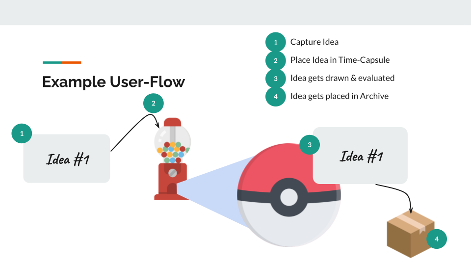
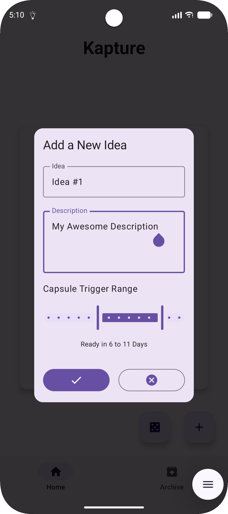
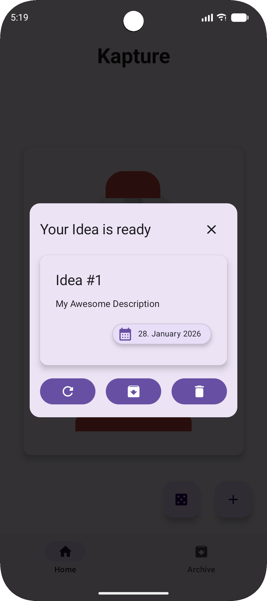

# kapture - Kotlin Idea-Time-Capsule App

kapture is a Kotlin-Multiplatform application designed to allow users to decide if an idea is good or not by putting it in a digital Time-Capsule released on a random date.

With kapture, users can create and describe an idea and set a future date range for when they want to be reminded of it. On the randomly selected date, the app will notify the user to revisit their idea and evaluate its worth.

If the user finds the idea valuable, they can choose to keep it in a permanent archive; otherwise, they can discard it or be reminded within the same date range again.

## Features
- Create and store ideas with descriptions
- Set a future date range for idea review
- Receive notifications on a randomly selected date within the specified range
- Evaluate and archive, postpone or discard ideas
- Cross-platform support for Android and iOS
- User-friendly interface for easy idea management
- Local data storage
- Offline functionality

## Example User Flow

1. User opens the kapture app and selects "+" (Add Idea)
2. User enters the idea title, description, and selects a future date range for review
3. The app saves the idea and sets a notification for a random date within the specified range
4. On the notification date, the user is prompted to review the idea
5. User decides to either archive, postpone, or discard the idea

  

  

## Used Technologies

- Kotlin Multiplatform Mobile (KMM)
- Jetpack Compose
- AlarmManager (Android)
- UserNotifications Framework (iOS)
- Local Storage
